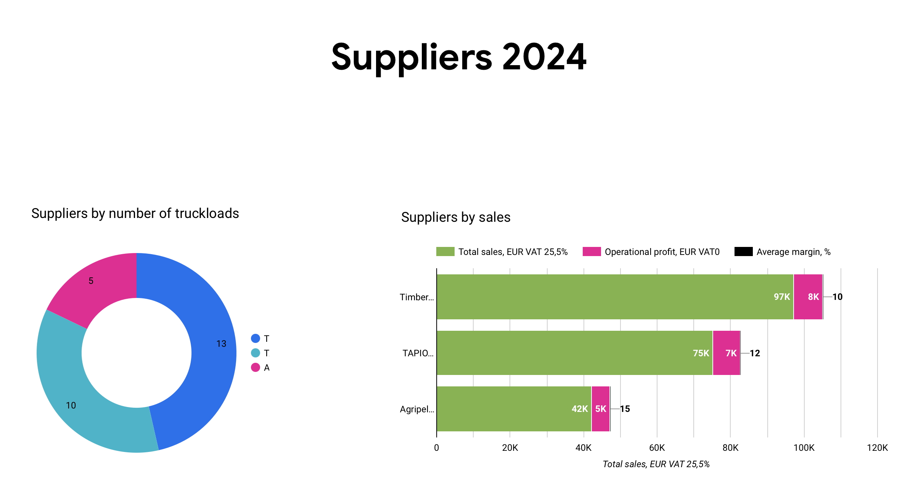
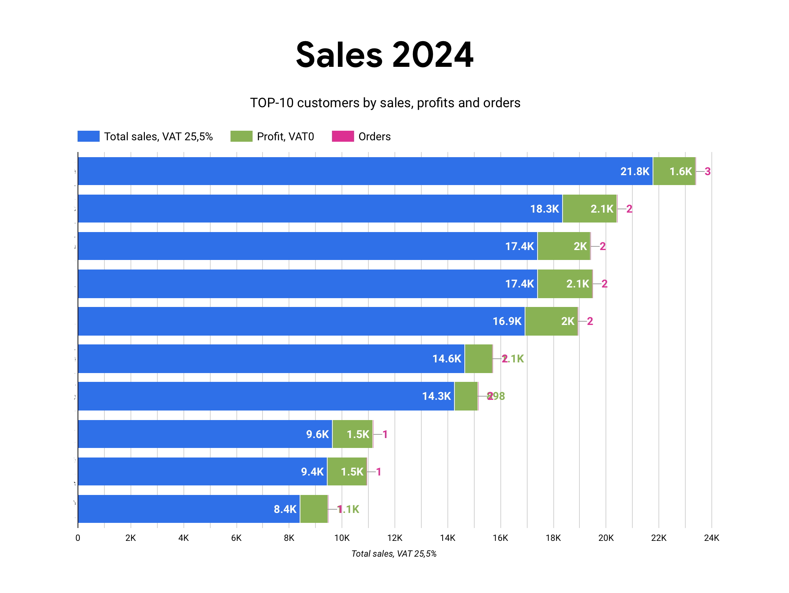

# Dashboards for Operational Business Management with Looker

## Business Case Overview
The company is a **biofuel trading firm** operating in **B2B commodity trading**, where securing margins depends on **dynamic pricing, supply chain efficiency, and logistics management**.

A key challenge was the **unstructured and dirty data** spread across multiple sources:  
- Sales, procurement, and logistics data in spreadsheets  
- Website CMS data  
- E-commerce application records  

To **enable data-driven decision-making**, I developed a system that:  
- **Extracts, cleans, and organizes data** before loading it into a structured **data warehouse (BigQuery)**.  
- **Uses Python for ETL** via APIs to fetch data from Google Sheets and other business platforms.  
- **Automates data refreshes and scheduled queries** in **BigQuery** for real-time insights.  
- **Leverages Looker dashboards** to provide live operational insights into sales, procurement, and supplier management.

The dashboards support **real-time operational margin tracking**, enabling informed decisions in **sales, sourcing, and logistics**.

---

## Monthly Sales Dashboard  
Provides a **month-to-date** overview of sales vs plan/KPIs, including customer insights.  

  

---

## Suppliers Dashboard  
Shows **year-to-date** sales volume (in truckloads), total revenue, and **average operational margin per supplier**.  
This dashboard is crucial for **B2B supplier management** and strategic sourcing.  

  

---

## Top 10 Customers Dashboard  
Highlights **year-to-date** performance of the **top 10 customers**, ranked by **sales volume and order count**.  
This dashboard helps **prioritize sales efforts and optimize marketing campaigns**.  

  

---

## Key Features  
- **End-to-End Business Analytics:**  
  - Extracted, cleaned, and structured business data to power real-time dashboards.  
  - Built operational analytics for **sales, procurement, and logistics**.  

- **Automated ETL & Data Pipelines:**  
  - Used **Python APIs** to fetch data from multiple sources.  
  - Structured and stored data in **BigQuery** for seamless querying.  

- **Looker-Powered Visualization:**  
  - Designed **interactive dashboards** to track key **business performance metrics (KPIs, margins, and supplier performance)**.  
  - Enabled **real-time business monitoring** to optimize pricing and sales.  

---

## Tech Stack & Tools Used  
| Tool         | Purpose |
|-------------|---------|
| **Looker**  | Data visualization & dashboarding |
| **Python**  | ETL (data extraction & transformation) |
| **BigQuery** | Data warehouse for structured queries |
| **SQL**     | Data cleaning, aggregation, and transformation |
| **Excel**   | Initial data exploration & preprocessing |

---

## What’s Next?
1. **Enhancing Dashboard Features** – Expanding to include **predictive analytics** for **pricing and demand forecasting**.  
2. **Integration with Other Business Apps** – Automating **reporting workflows** to trigger **alerts and notifications**.  
3. **Exploring AI/ML** – Building **automated anomaly detection** for price fluctuations.  

---

## Final Thoughts  
This project showcases **how BI tools like Looker, combined with strong ETL pipelines, can transform raw data into valuable business insights**.  

