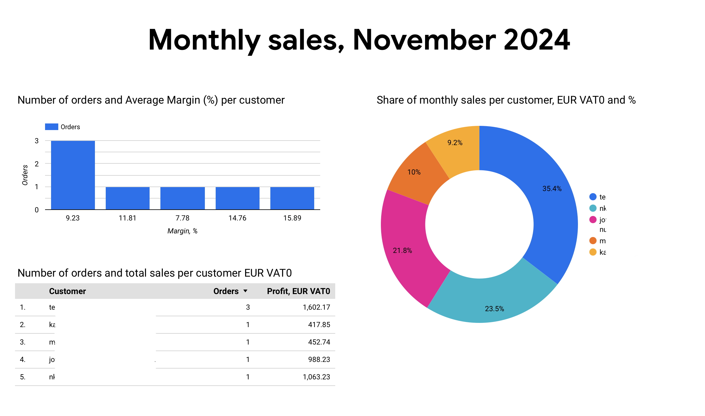

#  Dashboards for Operational Business Management with Looker

## Project Overview
This project showcases **interactive dashboards** built-in Looker for **real-time business operations monitoring**.  
The dashboards provide live **sales and operational margins** data which supports sales, procurement, logistics and marketing activities, helping improve decision-making and streamline business processes.

---

## Monthly Dales Dashboards
Reflects **month-to-date** sales data to inform on actual sales vs plan or KPIs and provides customer insights.

## Suppliers Dashboard
Shows **year-to-date** sales in total, in the number of truckloads, and average **operational margin per supplier**. The latter metric is vital in B2B wholesales of commodities and hugely supports sourcing and supplier management. 

## Top 10 customers
Shows **year-to-date** sales for top 10 customers by sales and number of orders and provides insights into operational margins supporting further sales and marketing activities.

---

## Key Features
- **End-to-End Business Analytics:** Extracted, cleaned, and transformed business data to build interactive dashboards.
- **Data-Driven Decision Making:** Provided operational insights for business growth.
- **ETL Process:** Automated data pipeline to clean and load data from multiple sources into **BigQuery**.
- **Looker Integration:** Designed and deployed interactive dashboards.

---

## Tech Stack & Tools Used
| Tool        | Purpose |
|------------|---------|
| **Looker** | Data visualization & dashboarding |
| **Python** | ETL (data extraction & transformation) |
| **BigQuery** | Data warehouse for structured queries |
| **SQL** | Data cleaning, aggregation, and transformation |
| **Excel** | Initial data exploration & preprocessing |

---

## 📂 Project Structure
